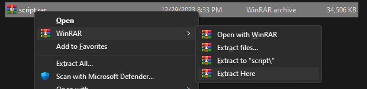
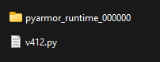

#### 1 - right click the downloaded RAR file 
#### 2 - hover over the "**WinRar**" option
#### 3 - choose "**extract here**"

#### 4 - enter the password 123
 

#### the  new folder should have 2 files in it : 
##### --- a python **file**
##### --- a pyarmor_runtime_000000 **folder**

