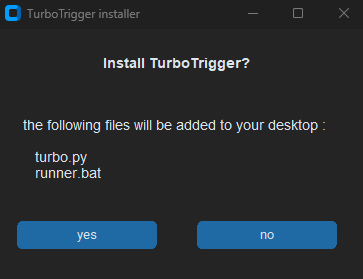
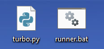
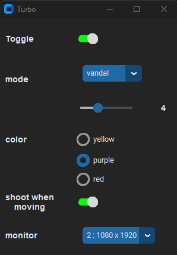

 

#### 1 -  now open the installer.exe

#### 2 - click yes

#### 3 - go to your Desktop and you will have 2 news files 
#### - runner.bat
#### - turbo.py

#### 4 - open runner.bat and it will launch the bot after entring your key

