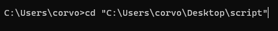

# final steps to get the pythong script working
#### 1 - go back to the folder you extracted 

#### 2 - right click and select "copy as path"

#### 3 - open cmd again and type ``cd`` followed by the path you copied then click enter
##### here what it should look like , your path will varry 

#### 4 - in the same cmd type   ``python`` followed by the name of the script which currently is ``python v412.py`` and tap enter

### and that should run the bot as usual

### from now to to run the bot you just do the steps in this section , so :
- copying the path
- pasting it in cmd after "cd"
- using "python" followed by the name of the script

