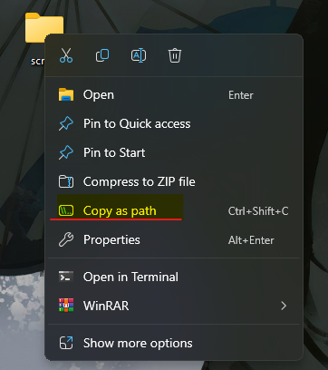
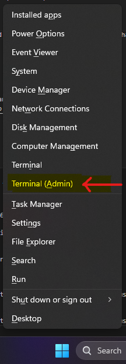
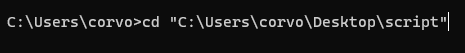

  

  

## How to Run the Python Script from Command Prompt as **ADMIN**

  

  

- ### 1 - create a new folder in your desktop and put turbo inside it

  

  

  

  

- ### 2 - Copy the Folder Path:

  

Right click the folder that has the script inside , then choose "copy as path"

and if you dont see this option , try holding down **SHIFT** when right clicking the folder

  

  

  

  

- ### 3- Open Command Prompt as Admin:

  

Press **Windows Key** + **X**.

  

Choose "Command Prompt (**Admin**)" or "Terminal (**Admin**)"

  

  

  

- ### 4- Navigate to Folder:

  

  

Type **cd** in Command Prompt then paste the Path you have copied with "ctrl+v" or right clicking

  

Press Enter.

  

  

  

- ### 5- . Run Script:

Type python turbo.py and press Enter.

  

