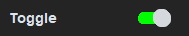
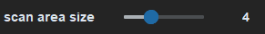
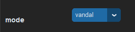
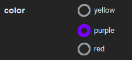
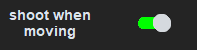

# Triggerbot User Manual

## Toggle

Simple on/off switch for the triggerbot.

## Scan Area Size (FOV)

The "Scan Area Size" option adjusts the triggerbot's Field of View (FOV) for target scanning.
- **Range**: 2 to 8, with higher values offering greater accuracy but slower speed, and lower values providing faster speed with slightly reduced accuracy.
- **Optimal Setting**: For 1080x1920 resolution, values around 3 or 4 are recommended for a balance between accuracy and speed.
- ***Usage***: Adjust the FOV setting in the triggerbot menu to suit your gameplay style and performance preferences.

## Mode

The "Mode" option adjusts the firing mode of the triggerbot for specific weapons and gameplay styles.
- **Vandal**: High fire rate with minimal recoil (Vandal rifle).
- **Guardian**: Balanced fire rate and recoil (Guardian rifle).
- **Sheriff**: Precise shots with controlled recoil (Sheriff pistol).
- **Fast**: Maximum fire rate, disregarding recoil.
- ***Usage***: Select the mode that suits your weapon and gameplay preferences.

## Colors

The "Colors" option allows you to customize the enemy outline colors displayed by the triggerbot.
- **Red**: Enemy outlines appear in red.
- **Purple**: Enemy outlines appear in purple.
- **Yellow**: Enemy outlines appear in yellow.
- ***Preference***: Purple is recommended for its visibility and clarity, while red is less preferable but still effective. Yellow is an alternative option.
- ***Usage***: Choose the color that best suits your preference for enemy outline visibility.

## Shoot When Moving

The "Shoot When Moving" option is a toggle that determines whether the triggerbot will fire when the player is moving or only when stationary.
- **Toggle**:
  - Enabled: The triggerbot will shoot even when the player is moving.
  - Disabled: The triggerbot will only shoot when the player is still.
- ***Usage***: Toggle this option based on your preference for shooting behavior while moving.
